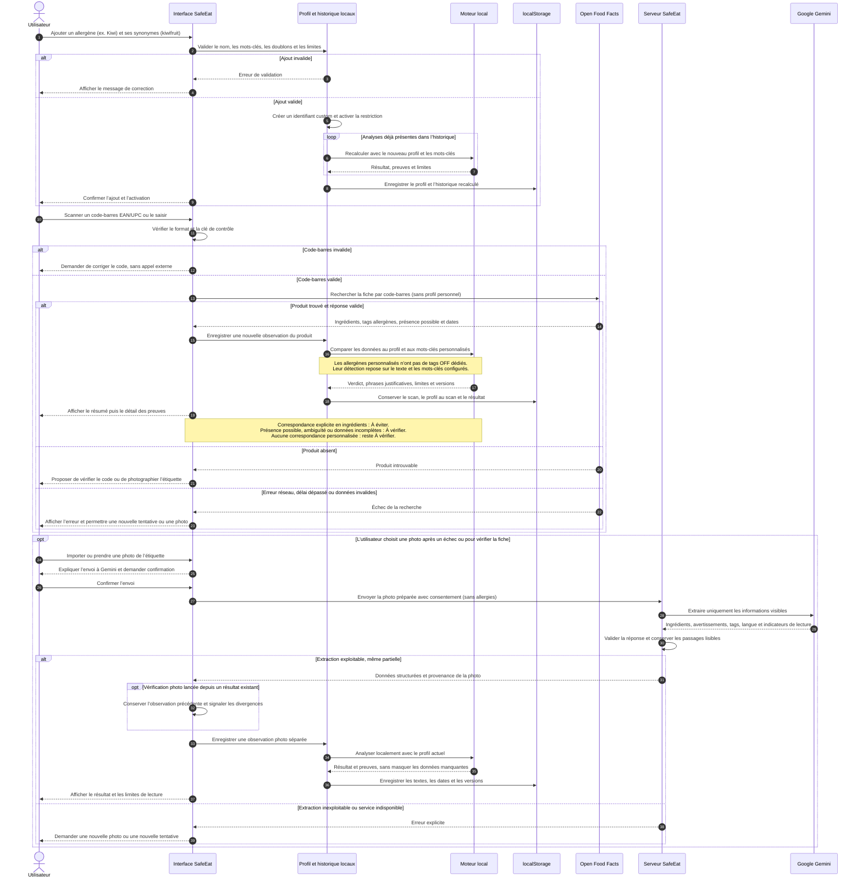

# SafeEat

Application React/Express de comparaison des ingrédients et traces d’un produit avec un profil d’allergies. Les codes-barres interrogent Open Food Facts ; les photos sont envoyées à Google Gemini après confirmation ou accord mémorisé dans les réglages IA. Le résultat est une aide à la lecture et ne garantit pas l’absence d’allergènes.

## Parcours : allergène personnalisé et scan d’un produit

Ce diagramme décrit le fonctionnement actuel du POC. L’allergène personnalisé est activé dès son ajout ; son nom et ses synonymes restent dans le navigateur. Le code-barres identifie le produit, mais ce sont les données d’ingrédients et d’avertissements qui sont analysées.



L’utilisateur choisit toujours la photo à importer ou à prendre. Par défaut, il confirme chaque envoi ; le réglage « Toujours envoyer les photos à l’IA » permet de mémoriser cet accord dans le navigateur. Open Food Facts et Gemini fournissent les données ; le moteur local produit le verdict. Une absence de correspondance pour un allergène personnalisé reste inconclusive, même après relecture de l’étiquette.

## Installation et lancement

Utiliser Node.js 22 ou supérieur et npm. Depuis la racine du projet :

```sh
npm ci
cp .env.example .env
npm run dev
```

Le serveur charge `.env`. Renseigner `GEMINI_API_KEY` pour activer l’analyse photo et les suggestions de synonymes ; les codes-barres fonctionnent sans clé. `GEMINI_MODEL` permet de choisir un modèle accessible au compte. Le modèle par défaut `gemini-3.5-flash-lite` a été vérifié avec une étiquette fictive ; les réglages de réflexion apparaissent dans les [exemples officiels Google](https://ai.google.dev/gemini-api/docs/generate-content/thinking) ; son accès effectif dépend de la clé et du quota.

Production :

```sh
npm run build
npm start
```

`npm start` sert par défaut `dist/client` en production. `NODE_ENV=development` est une dérogation explicite ; ne pas la définir pour un déploiement de production. Le serveur compilé et sa carte source restent en dehors du dossier servi. `npm run preview` prévisualise uniquement le frontend et ne fournit pas l’API photo.

L’application écoute par défaut sur `127.0.0.1:3000`. `PORT` et `HOST` sont configurables. Pour un conteneur, définir `HOST=0.0.0.0`. Utiliser HTTPS pour l’accès caméra hors localhost. `/api/health` indique la santé du processus et si l’IA est configurée ; il ne teste pas le fournisseur.

## Vérifications

```sh
npm run check
npm run smoke
```

Le mode TypeScript strict, ESLint (hooks React et accessibilité), les tests et la compilation sont exécutés par `check`. La CI reproduit ces contrôles sur Node 22, teste le serveur compilé puis vérifie son fonctionnement sans dépendances de développement. Les routes sont chargées à la demande et le scanner est séparé du JavaScript initial.

Les tests HTTP ouvrent des ports locaux temporaires. La suite utilise des réponses fournisseur simulées ; un test réel doit utiliser une étiquette fictive et une clé autorisée. Ne jamais enregistrer une vraie clé dans Git ou dans les résultats de test.

## API photo et limites

### Contrat de détection du POC

Le périmètre de conclusion est limité aux étiquettes françaises de produits préemballés. Les mots anglais existants peuvent déclencher une alerte, mais une langue non prise en charge empêche une conclusion sans correspondance. Le moteur local, versionné avec son dictionnaire, ne certifie jamais qu’un produit est sûr.

- Une mention explicite dans les ingrédients ou un tag allergène déclenche « À éviter », même si les données sont partielles.
- Une présence possible, un avertissement d’atelier ou un terme d’origine ambiguë déclenche « À vérifier ». « Peut contenir » n’est pas une trace confirmée.
- Des ingrédients absents, une complétude/lisibilité inconnue, des avertissements non vérifiés, une langue inconnue, une restriction non prise en charge ou un conflit empêchent un résultat rassurant.
- « Aucune correspondance » nécessite la relecture explicite du produit, de la liste complète et de toutes les zones d’avertissements sur l’emballage français. Cela ne garantit pas l’absence d’allergènes ni de contamination croisée. La confirmation utilisateur peut elle-même être erronée.
- Une correspondance personnalisée explicite déclenche une alerte ; une recherche personnalisée sans correspondance reste inconclusive.

Depuis le résultat, « Vérifier ce produit avec une photo » crée une observation séparée, conserve les textes précédents et signale leurs divergences. Les différences de format peuvent également déclencher une vérification : aucune résolution automatique par fusion ou vote. Une relecture est enregistrée séparément, sans modifier le scan initial ni rafraîchir artificiellement la date de consultation. Les tags sans phrase source n’obtiennent jamais de citation inventée. Les anciennes analyses sont recalculées conservativement à la restauration.

L’API photo conserve les passages lisibles d’une extraction partielle et transmet `labelReadable`, `ingredientsComplete`, `warningsComplete`, `language` et `warningsText`. Une réponse structurée valide n’atteste pas la fidélité de la lecture. Les anciens fournisseurs simulés sans nouveaux champs sont acceptés, mais restent inconclusifs. L’analyse photo n’envoie pas le profil d’allergies au fournisseur.

Le corpus figé de `tests/safety-corpus.test.ts` couvre les catégories standards, les dérivés explicites, les négations, les exceptions limitées, les avertissements, la complétude, les conflits et la restauration. Il est **synthétique, non validé médicalement**. Les tests HTTP simulent le fournisseur : ils ne mesurent pas les omissions réelles de Gemini sur les photos.

Avant un usage réel : constituer un corpus de photos d’étiquettes avec transcription et annotations revues, mesurer séparément les omissions d’extraction et les erreurs du moteur, puis faire relire les règles par une personne qualifiée. L’ajout de synonymes sans validation humaine, le multilingue étendu, le cache inter-achats et l’optimisation supplémentaire des images restent hors de cette étape. Le dictionnaire lexical reste incomplet ; les exceptions réglementaires et les distinctions allergie/intolérance ne constituent pas une ontologie médicale implémentée.

### Transport et quotas

`POST /api/analyze-image` accepte un objet JSON `{ imageBase64, consent: true }`, avec une image JPEG/PNG/WebP de moins de 4 Mo. Les réponses réussies contiennent les ingrédients, les tags et la provenance. Les erreurs sont JSON avec `error.code`, `error.message` et `error.retryable`.

Les appels sont limités à 30 demandes POST par IP sur 15 minutes, deux analyses simultanées et 100 tentatives fournisseur par jour UTC. Le délai par défaut est de 30 secondes. Les variables `AI_MAX_CONCURRENCY`, `AI_DAILY_LIMIT`, `AI_TIMEOUT_MS` règlent ces limites. Les compteurs sont en mémoire et reviennent à zéro au redémarrage ; pour plusieurs instances, prévoir un stockage partagé et un budget côté fournisseur. Les limites protègent un petit déploiement, elles ne remplacent pas une stratégie de quota globale.

Derrière un reverse proxy, définir `TRUST_PROXY_HOPS` au nombre exact de relais de confiance ; laisser zéro sans proxy. Ne pas exposer directement un serveur configuré pour faire confiance à des relais inexistants.

## Confidentialité

Les analyses réussies sont enregistrées automatiquement (50 au maximum) et rouvertes via leur identifiant local, y compris les photos après rechargement. Les résultats sont recalculés avec le profil actuel ; les dates de consultation des données restent inchangées.

Le profil et l’historique sont conservés dans le localStorage du navigateur, sans compte ni synchronisation. Le serveur SafeEat ne conserve pas les photos et ne journalise pas leur contenu. Google reçoit la photo pour l’extraction ; consulter les règles du fournisseur applicables au compte. Éviter les photos contenant des informations personnelles.

Le [rapport initial](RAPPORT_AUDIT.md) décrit les défauts découverts avant les corrections et sert de référence historique.

## Suggestions de synonymes par IA

Dans « Ajouter mon allergène », le badge bleu avec l’icône d’étincelles déclenche `POST /api/suggest-synonyms` avec `{ "name": "Kiwi" }`. Seul ce nom est envoyé à Google Gemini ; le profil et l’historique ne sont pas transmis. Le serveur réutilise `GEMINI_API_KEY`, `GEMINI_MODEL` et le délai configuré pour l’IA.

La réponse est `{ "synonyms": ["kiwifruit", "actinidia deliciosa"] }`. Les noms sont nettoyés, dédupliqués, limités à 19 propositions de 60 caractères maximum. L’utilisateur peut modifier un tag, le supprimer ou le retenir avec « + ». Seuls les noms retenus, ainsi que ceux saisis manuellement, sont enregistrés localement avec « Ajouter et activer ». Les propositions restantes sont ignorées. Une absence de suggestions est un résultat valide ; en cas d’erreur ou sans clé API, la saisie manuelle reste disponible.

Ces propositions ne sont pas exhaustives et peuvent être inexactes ; elles ne changent pas les limites du moteur pour les allergènes personnalisés. Les deux routes IA partagent les limites de fréquence, de concurrence et le budget quotidien. L’API renvoie des erreurs JSON pour un nom invalide (400), des propositions invalides (422), un quota atteint (429), un fournisseur indisponible (503) ou un délai dépassé (504).

## Preview Vercel

`vercel.json` publie `dist/client` et dirige `/api/*` vers la fonction Express `api/index.ts`. Les routes React (par exemple `/profile`) utilisent le repli vers `index.html`, qui exclut les routes API. Le serveur local et la fonction utilisent la même configuration.

Configurer `GEMINI_API_KEY` dans l’environnement **Preview** du projet Vercel, ainsi que `GEMINI_MODEL` si nécessaire, puis redéployer. La clé reste côté serveur et ne doit pas être préfixée par `VITE_`. `/api/health` doit renvoyer du JSON ; `/api/suggest-synonyms` doit renvoyer une erreur JSON explicite si la clé manque, jamais une page 404 statique. Les quotas en mémoire sont propres à chaque instance : ils ne constituent pas une limite globale persistante sur Vercel. Le corps d’une requête reste également soumis à la limite de la plateforme, notamment pour les photos.

## Réglages IA

La section « Intelligence artificielle » du profil regroupe l’analyse des photos, l’envoi sans confirmation et l’accès aux suggestions de synonymes. Les choix restent locaux au navigateur, séparés du profil d’allergies. Les anciens profils reçoivent les réglages par défaut : analyse photo et suggestions disponibles, confirmation obligatoire pour chaque photo.

« Toujours envoyer les photos à l’IA » vaut uniquement pour une photo explicitement choisie ou prise par l’utilisateur, jamais pour une capture automatique. Le scanner affiche ce mode et un lien vers les réglages. Désactiver ce choix rétablit la confirmation ; désactiver l’analyse photo bloque les envois et révoque également l’accord mémorisé. Le réactiver ne rétablit pas cet accord. Les vérifications depuis un résultat gardent la comparaison avec l’observation précédente dans les deux modes.

Désactiver les suggestions IA bloque leur demande et annule une demande en cours ; les synonymes déjà enregistrés et la saisie manuelle restent disponibles. Ces réglages ne modifient ni le verdict ni le dictionnaire. Les photos sont transmises à Google Gemini, sans stockage sur le serveur SafeEat. Le nom saisi pour les suggestions est également transmis à ce fournisseur à la demande.

### Vérifier le démarrage de l’API Vercel

`npm run check:api` compile le point d’entrée et ses dépendances avec les règles Node ESM, puis démarre le code JavaScript compilé dans Node, sans `tsx` ni Vite. Ce contrôle fait partie de `npm run check` et vérifie `/api/health` ainsi que la validation des demandes de synonymes. Les imports relatifs du graphe serveur utilisent des extensions `.js` explicites pour que le code émis reste résoluble par Node en production.

### Moteur de lecture des codes-barres

La page Scanner passe par l’interface `BarcodeScanner` (`src/services/scanner/`). Scanbot Web SDK est le moteur par défaut ; `VITE_BARCODE_SCANNER=html5` réactive html5-qrcode à la prochaine construction. Les deux moteurs lisent EAN-8, EAN-13 et UPC-A et proposent le même cycle démarrage/arrêt et le contrôle du flash lorsque la caméra le permet.

La licence temporaire fournie couvre `localhost` et `safe-foods.vercel.app`. Pour la remplacer, définir `VITE_SCANBOT_LICENSE_KEY` et reconstruire le site. Cette licence est destinée au navigateur et apparaît dans le client compilé. Une URL de preview Vercel nécessite une licence couvrant son domaine. Après expiration, le scanner affiche une erreur ; la saisie manuelle et l’import photo restent accessibles. Le changement de moteur est explicite, sans bascule automatique qui masquerait un problème de licence.

Les fichiers JS/WASM du moteur barcode-only sont copiés depuis le paquet npm vers `public/scanbot-engine/` avant le développement et la construction, puis servis avec le site. Ils sont générés et exclus du dépôt. Le SDK est chargé à l’ouverture du scanner ; le mode multithread est désactivé pour fonctionner sans en-têtes d’isolation supplémentaires.
